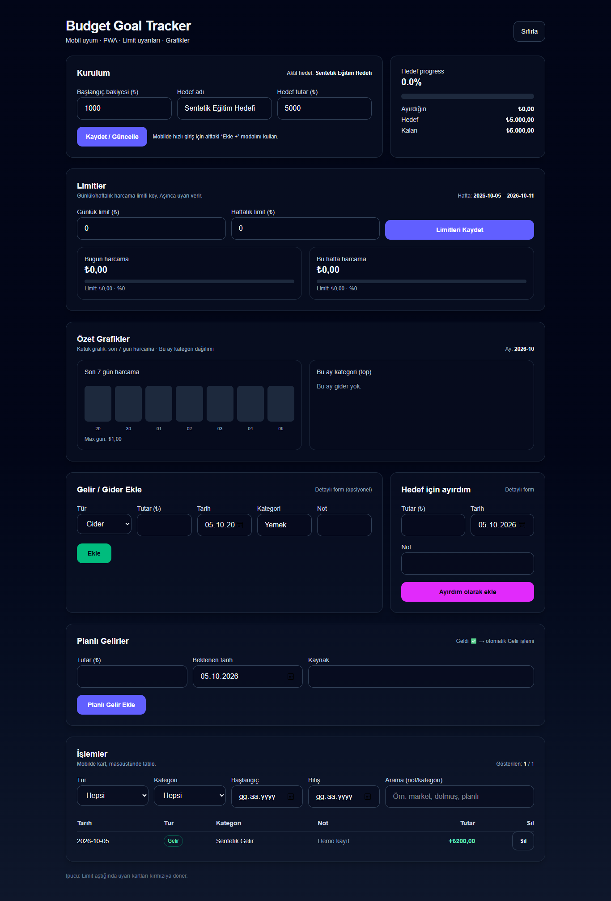
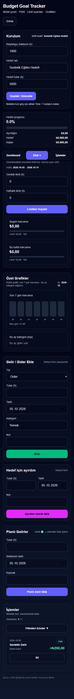

# KNC Budget

Gelir, gider ve birikim hedeflerini tarayıcıda takip eden mobil uyumlu web uygulaması. Hesap veya backend gerektirmez; kayıtlar localStorage içinde tutulur.

- Başlangıç bakiyesi, gelir/gider kayıtları, kategoriler ve notlar.
- Birikim hedefi ve ayrılan tutarlar; günlük / haftalık limitler.
- Planlı gelirler, filtreleme ve dönemsel özet grafikler.
- Next.js 16.3.8, React 19.2.3, TypeScript 5, Tailwind CSS 4.

## Kurulum

Node.js 20.9+ ve npm gerekir; kontroller Node.js 22.17.1 ile çalıştırıldı.

```sh
git clone https://github.com/kubracemiloglu/knc-budget.git
cd knc-budget
npm ci
npm run dev -- --hostname 127.0.0.1
# http://127.0.0.1:3000
npm run lint
npm run build
npm start -- --hostname 127.0.0.1
```

.env veya servis anahtarı gerekmez. İlk açılışta hedef ve başlangıç bakiyesini belirleyin; gelir/gider ekleyin. Görsellerdeki tutarlar ve notlar sentetiktir.

## Doğrulama ve bilinen sınırlar

2026-10-05: lint ve üretim derlemesi geçti. Temiz Edge oturumunda hedef / başlangıç bakiyesi kaydetme, sentetik gelir ekleme ve sayfa yenilendikten sonra kayıtların korunması doğrulandı. 390 px genişlikte yatay taşma ve JavaScript hatası görülmedi; dış istekler engellendi. Bağımsız otomatik test paketi bulunmuyor; diğer hesaplama ve planlı gelir senaryolarının tüm kombinasyonları test edilmedi.

Tarayıcı verisi temizlenirse kayıtlar silinir; cihazlar arasında eşitleme, sunucu yedeği ve kullanıcı yetkilendirmesi yoktur. Finans kayıtları şifrelenmez. Manifest ve ikonlar vardır; servis çalışanı / tam çevrimdışı destek doğrulanmadı. Canlı demo bağlantısı verilmemiştir.

İlk açılışta boş başlangıç durumunun saklanan kayıtları ezmesini önleyen yükleme kontrolü eklendi. Güvenlik taramasındaki Next.js bulguları için aynı ana sürümde gerekli güncelleme yapıldı; kilit dosyası güncellendi. Ayrıntılı kontrol kapsamı yayımlama raporunda bulunur.

## Ekran görüntüleri




Kübra Nur Cemiloğlu · Ege Üniversitesi Bilgisayar Programcılığı mezunu.

Bağımlılık kontrolü (2026-10-05): npm audit --omit=dev 0 bulgu verdi. Tam audit geliştirme araçlarının braces / micromatch / fast-glob zincirinde 5 yüksek seviye bulgu bildirdi. Önerilen zorunlu sürüm düşürme uygulanmadı; geliştirme araçlarını güvenilir yerel proje dosyalarıyla kullanın. Bu tarama tüm güvenlik risklerinin yokluğunu garanti etmez.
